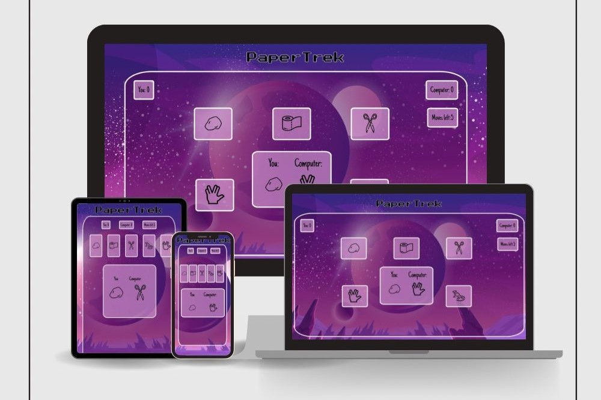
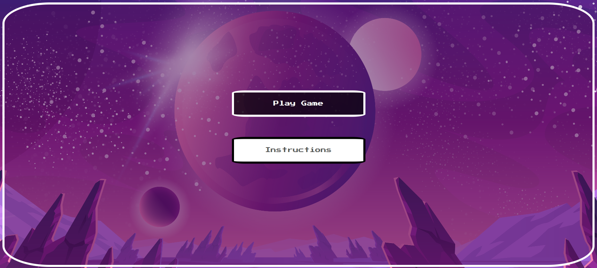
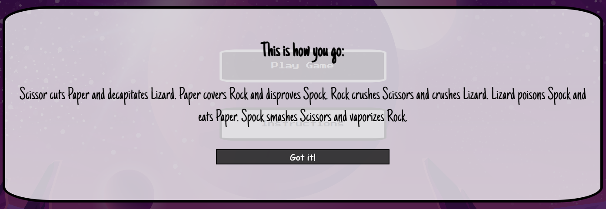

# PaperTrek

Papertrek is a website made for the puzzles and The Big Bang Theory fans. The goal of this website, is giving the user a challenging opponent to play a against in a variation of Rock, Paper and Scissors. The game is made of 5 moves, and once the moves are out, the one with more points win the game.

----

## Features 

PaperTrek is a simple and well designed page. The website has a galactical theme and presents a challenging game. In it's layout it has a Game Menu page, where you can choose between reading the instructions or starting the game. On the game, the player has 5 options to choose, between: Rock, Paper, Scissors, Lizard and Spock. The option choosen both by player and computer, are showed on the display. Once the game is over, a modal pops up, telling who the winner was and also giving an option to restart the game.

### Existing Features

- __Game Menu__

    - The section game menu is the one the user arrives when accessing the website. This page contains 2 buttons, one to start playing and another one containing the instructions. 

    

- __Instructions__

  - The instructions button pops up a modal, that teaches the player how to play the game.
 

  

- __Gaming Area__

    - This section group all the features on the website. Here you find the buttons to play the game, the score and the display that shows the options chosen. 

    

- __Score__

    - This section shows the score and the moves left. It's updated everytime the player pick a movement. 

    

- __Result__

    - This modal pops up once the game is over. It tells who was the winner and gives and option to restart the game. 

    

----

  ## Testing 

The website passed in all tests with a high performance and accessibility. The only attribute that can me improved is the image format. The images need to be converted to a modern formact.

### Validator Testing 

- HTML
  - No errors were returned when passing through the official [W3C validator](https://validator.w3.org/nu/?doc=https%3A%2F%2Fvepp1.github.io%2Fpapertrek%2F)
- CSS
  - No errors were found when passing through the official [(Jigsaw) validator](https://jigsaw.w3.org/css-validator/validator?uri=https%3A%2F%2Fvepp1.github.io%2Fpapertrek%2F&profile=css3svg&usermedium=all&warning=1&vextwarning=&lang=en)
- JavaScript
  - No errors were found when passing through the official [JSHint Validator](https://jshint.com/)

### Unfixed Bugs

None. 

----

## Deployment

- The site was deployed to GitHub pages. The steps to deploy are as follows: 
  - In the GitHub repository, navigate to the Settings tab 
  - From the source section drop-down menu, select the Master Branch
  - Once the master branch has been selected, the page will be automatically refreshed with a detailed ribbon display to indicate the successful deployment. 

The live link can be found here - https://vepp1.github.io/indians-live/index.html

----

## Credits 

### Content 

- The icons in the footer were taken from [flaticon](https://www.flaticon.com/)
- W3Schools articles, helped me solve bugs on my project.